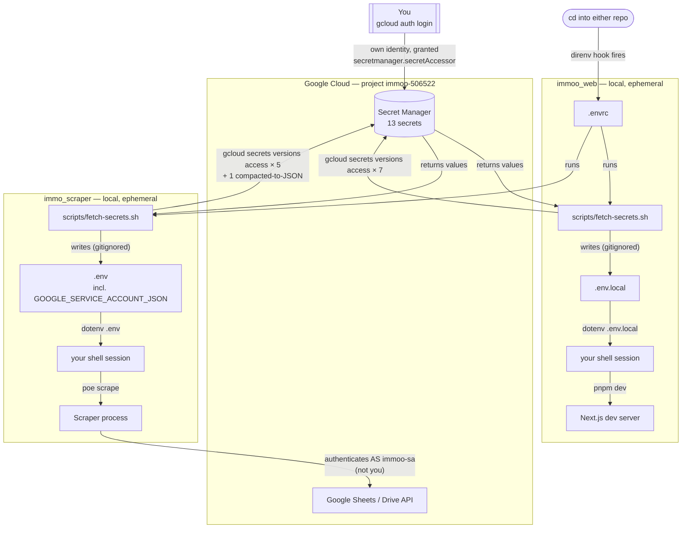

# Secrets management

Neither app reads a static credential file anymore. Every secret is fetched
from Google Cloud Secret Manager (project `immoo-506522`), triggered
automatically by `direnv` the moment you `cd` into either repo, written to a
gitignored local file, and never committed. Two separate identities are
involved — don't conflate them:

- **Your own Google identity** (`gcloud auth login`) is what's allowed to
  *read* Secret Manager. It has no bearing on what the app does at runtime.
- **The `immoo-sa` service account** is a secret stored *inside* Secret
  Manager. Once fetched, it's what `immo_scraper` uses to authenticate to
  Google Sheets/Drive — a completely different identity from yours.

**Note on direnv:** it doesn't run `.envrc` directly in your shell — it runs it
in an isolated subshell, diffs the resulting environment, and applies only
that diff to your real session. That's why `direnv allow` exists (approving
arbitrary code execution per directory), and why the variables *disappear
again automatically* the moment you `cd` out.

## Why this exists

`.env`/`.env.local` and the `immoo-sa` service-account key used to sit as
plain files inside `Documents/IOctane`, a folder that syncs to iCloud.
Secret Manager is now the only source of truth. The `.env` files are
regenerated on demand and can be deleted at any time without losing
anything — and as of this version, **no service-account key file exists on
disk at all**: `immo_scraper/src/services/storage.py` reads it as parsed
JSON from `GOOGLE_SERVICE_ACCOUNT_JSON` via
`service_account.Credentials.from_service_account_info()`, with a fallback
to a file path only if that env var isn't set.

## Adding a new secret

1. `gcloud secrets create <name> --data-file=-` (or `--data-file=path`)
2. Add a `fetch <name>` call to the relevant `scripts/fetch-secrets.sh`
3. Grant yourself `roles/secretmanager.secretAccessor` on the project if you
   haven't already (only needed once per Google identity)

Linear issue: _none — this predates the per-issue UML convention. Future
diagrams in this folder should be named `<LINEAR-ID>-slug.md`._
